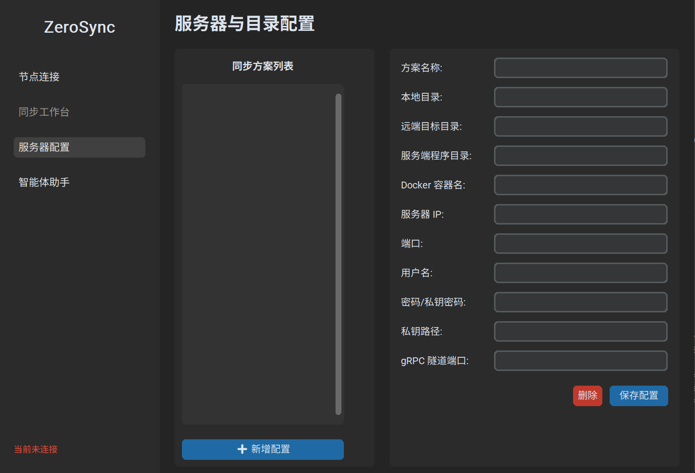
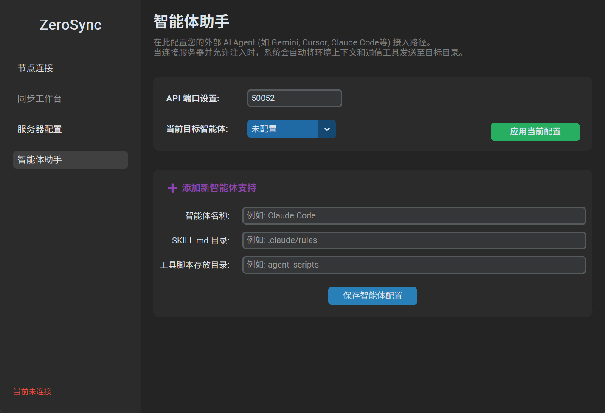
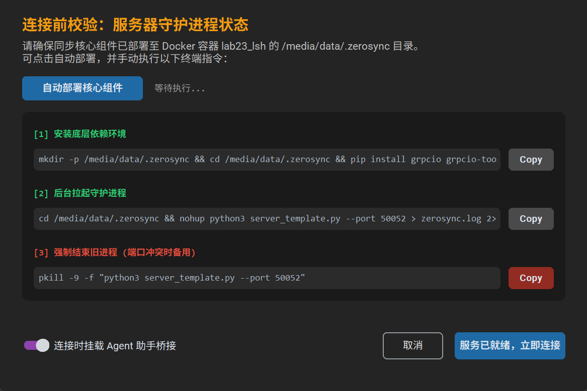
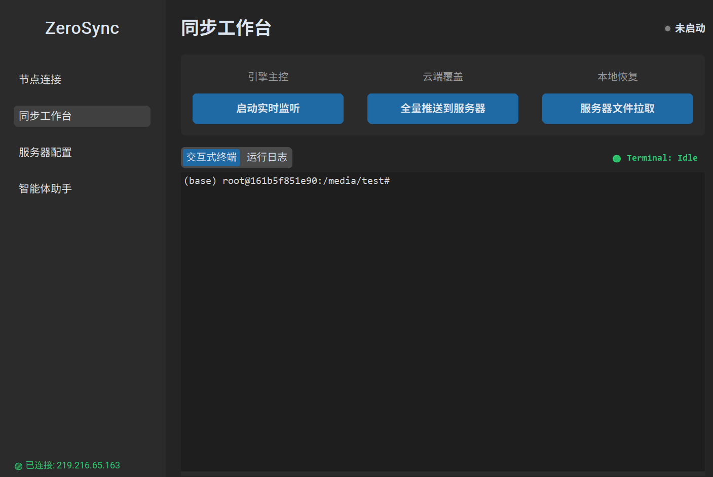

# ZeroSync 使用说明书

本指南将协助您快速配置并启动 ZeroSync。请按照以下四个核心步骤，打通本地与远端的开发边界。

## 核心操作流程

### 第一步：服务器与同步方案配置

在 **“服务器配置”** 菜单中，您可以创建并管理多个远程同步方案。

1.  **方案管理**：点击左下角 **“+ 新增配置”** 开始创建。
2.  **核心路径配置**：
    *   **本地目录**：本地代码存放路径。
    *   **远端目标目录**：服务器上接收同步代码的路径。
    *   **服务端程序目录** **（重要）**：存放服务器端服务脚本的路径。
3.  **连接与穿透**：
    *   填写服务器 IP、端口、用户名及鉴权信息（支持密码与私钥）。
    *   **Docker 容器名**：若在容器内开发，填写容器名即可实现自动击穿，无需在容器内装 SSH。
    *   **gRPC 隧道端口**：默认 50051，用于底层数据流传输。
4.  点击 **“保存配置”**。

---

### 第二步：智能体助手接入配置

在 **“智能体助手”** 页面，配置如何将 ZeroSync 的远程服务器连接技能注入给您的 AI 工具。

1.  **网关设置**：设置 **API 端口**（默认 50052），这是 Agent 调用工具的本地入口。
2.  **添加智能体支持**：
    *   **智能体名称**：如 `Claude Code`, `Gemini CLI`, `Cursor`。
    *   **SKILL.md 目录**：该 Agent 读取自定义指令的规则目录。
    *   **脚本目录**：Agent 存放外部工具 Python 脚本的目录。
3.  点击 **“保存智能体配置”** 并 **“应用当前配置”**。

---

### 第三步：连接校验与启动

点击左侧 **“节点连接”** 菜单，选择方案并点击 **“连接服务器”**。此时系统会弹出 **“连接前校验”** 窗口：

1.  **自动部署**：点击 **“自动部署核心组件”**，系统会尝试自动将服务端脚本推送到您在第一步设置的“服务端程序目录”。
2.  **手动补漏**：如果自动部署受限，您可以点击 **Copy** 按钮手动在远端终端执行指令：
    *   `[1]` 安装底层依赖（grpcio, zstandard 等）。
    *   `[2]` 后台拉起守护进程（使用 nohup 运行）。
    *   `[3]` 端口冲突时强杀旧进程。
3.  **Agent 挂载**：确保左下角 **“连接时挂载 Agent 助手桥接”** 处于开启状态（紫色）。
4.  校验通过后，点击 **“服务已就绪，立即连接”**。
5.  **关键提示（重载技能）**：由于 ZeroSync 在每次建立连接时，都会向目标目录发射包含**动态API Token** 和**实时环境上下文**的最新技能文档。因此，**建议您在每次启动本软件并成功连接服务器后，都在您的智能体中执行一次“重载技能”操作**，以确保 Agent 能够识别到最新的连接状态。

---

### 第四步：进入同步工作台

连接成功后，点击 **“同步工作台”**，这是您的核心操作区：

1.  **核心控制区**：
    *   **启动实时监听**：点击后，本地文件夹内部所有操作将实时同步至远端。
    *   **全量推送到服务器**：首次使用或两端差异过大时，执行一键全量上传。
    *   **服务器文件拉取**：从服务器拉取训练好的模型或日志。
    *   **必读操作规范**：请**务必**通过本软件内置的拉取功能回传远端文件。**严禁在同步监听开启时，使用外部 SFTP 客户端或 SCP 指令手动将远端文件下载到本地同步目录中**。否则，本地引擎会将其误判为“本地新增文件”并再次触发推送到服务器的动作，造成严重的带宽浪费与同步状态混乱。
2.  **终端与日志**：
    *   **交互式终端**：原生 PTY 环境，已自动进入目标目录并激活 Conda，支持 Docker 穿透。
    *   **运行日志**：实时打印软件日志，用于报错诊断。

---

## 💡 智能体技能启用（可选）

ZeroSync 本身是一款开发同步工具。如果您希望进一步解放双手，让 AI 智能体能够**随心所欲地自动操作服务器、查看日志或部署服务**，建议为其导入 ZeroSync 的智能体技能。

### 开启流程

由于不同智能体软件的操作逻辑各异，通用操作逻辑如下：

1.  **启动软件**：完成服务器连接，并进入同步工作台。
2.  **开启监听**：点击 **“启动实时监听”** 按钮。
3.  **重载技能**：在您的智能体软件中执行**重新加载技能/激活**的操作。
4.  **激活使用**：此时，您的智能体已获得远程服务器的操作权限，您可以尝试向它下达涉及服务器的操作指令。

一旦技能激活，您的 AI 智能体将获得完全无隔阂操作远端服务器的能力。它能够基于您的自然语言意图，自动编写指令，操纵服务器。

---

**注意事项：**
*   **单向驱动**：始终保持“本地修改、远端接收”的思维，避免在远端直接通过 vim 修改代码。